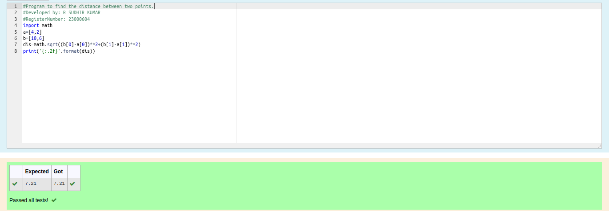

# DISTANCE-BETWEEN-TWO-POINTS

## AIM:
To write a python program to find the distance two 2 points
## ALGORITHM:
### Step 1: 
import the module
### Step 2: 
assign the values to the variables
### Step 3: 
Substitute the values in the distance formula  
### Step 4:
print the output
### PROGRAM:
```python
#Program to find the distance between two points.
#Developed by: R SUDHIR KUMAR
#RegisterNumber: 23000604
import math
a=[4,2]
b=[10,6]
dis=math.sqrt((b[0]-a[0])**2+(b[1]-a[1])**2)
print('{:.2f}'.format(dis))
```
### OUTPUT:



### RESULT:
Thus the distance two 2 points are calculated and successfully executed